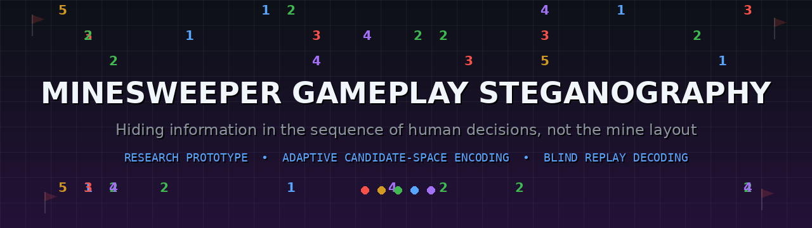
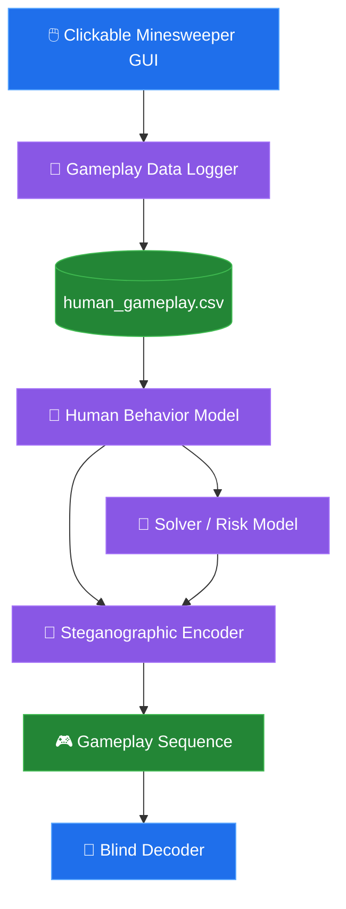
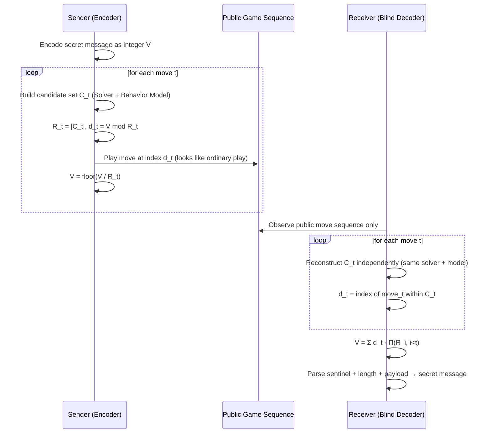
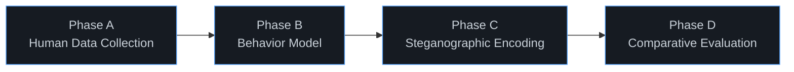
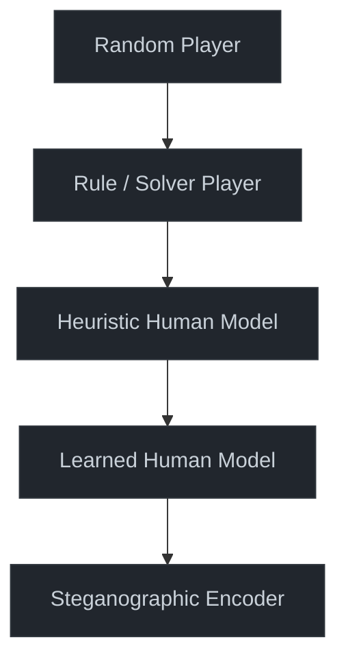
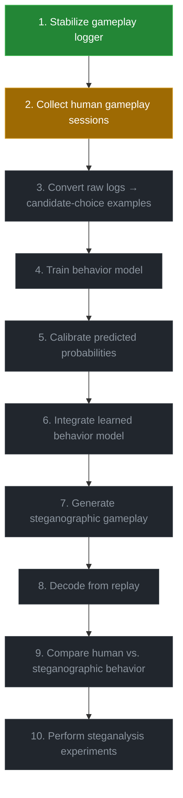

<div align="center">




**A Minesweeper clone that hides messages in *how* it's played — not in where the mines are.**

</div>

---

## 📑 Table of Contents

- [🧭 Research Idea](#-research-idea)
- [🏗️ Current Architecture](#️-current-architecture)
- [🔁 How Encoding & Decoding Work](#-how-encoding--decoding-work)
- [🧩 Project Components](#-project-components)
- [🧮 Minesweeper Mathematical Model](#-minesweeper-mathematical-model)
- [🧠 Human Behavior Modeling](#-human-behavior-modeling)
- [🔐 Steganographic Encoding](#-steganographic-encoding-in-gameplay)
- [📡 Blind Replay Decoder](#-blind-replay-decoder)
- [📊 Human Gameplay Dataset](#-human-gameplay-dataset)
- [🧪 Research Methodology](#-research-methodology)
- [📈 Main Evaluation Metrics](#-main-evaluation-metrics)
- [🧱 Baselines & 🔬 Ablations](#-baselines)
- [✅ Current Status](#-current-status)
- [🗺️ Roadmap](#️-next-development-steps)
- [📁 Repository Structure](#-repository-structure)
- [▶️ Running the Game](#️-running-the-game)
- [🎓 Research Caveat](#-research-caveat)
- [❓ Questions a Professor May Ask](#-questions-a-professor-may-ask)
- [📚 Formula Sheet & Terminology](#-appendix-a--compact-formula-sheet)
- [👥 Authors](#-authors)

---

## 🧭 Research Idea

A research-oriented Minesweeper system that explores **steganography through gameplay decision sequences**, rather than directly modifying the hidden mine layout.

The project combines a clickable Minesweeper environment, gameplay data collection, logical solving, probability estimation, human-behavior modeling, and adaptive steganographic move selection.

> [!NOTE]
> **Classical approach:** hide the message in the mine configuration itself.
> **This project's approach:** hide the message in **the sequence of gameplay decisions** made during a session.

**Primary research question:**

> How much information can be embedded into Minesweeper gameplay while keeping the resulting sequence safe, playable, and behaviorally similar to natural human gameplay?

This breaks into four sub-problems:

| # | Sub-problem |
|---|---|
| 1 | How should the system identify moves that are valid and reasonably safe? |
| 2 | How can real human move preferences be measured instead of guessed? |
| 3 | How can the available decision space be converted into variable information capacity? |
| 4 | How can the embedded sequence be decoded from gameplay alone and evaluated against steganalysis? |

The long-term goal is to select among multiple plausible moves so that the selected move carries information while still looking like a normal player's decision.

---

## 🏗️ Current Architecture



---

## 🔁 How Encoding & Decoding Work

The receiver is never handed the secret bits directly — only the public game replay. It reconstructs the same candidate sets independently and reads the message back out of *which* moves were chosen.



> [!TIP]
> Because both sides rebuild the candidate list from the same public rules, no side-channel metadata (radix values, digit indices) ever needs to travel with the message — only the gameplay itself.

---

## 🧩 Project Components

| File | Role |
|---|---|
| 🖥️ `clickable_minesweeper.py` | Tkinter GUI — reveal, flag, chord, mine counter, timer, restart, first-click-safe generation, win/loss detection, **automatic gameplay logging**. Lets a human play naturally with no manual candidate typing. |
| ⚙️ `minesweeper.py` | Core game logic — board generation, mine placement, neighbor calculation, number generation, flood-fill reveal, flag handling, game state, win/loss logic. |
| 🧮 `solver.py` | Visible-state solver. Derives guaranteed-safe cells, guaranteed mines, constraint relationships, candidate cells, and estimated mine probabilities — using only what's visible, never the hidden mine map. |
| 🔐 `encoder.py` | Adaptive gameplay steganography. Represents the secret as an integer and embeds it through **mixed-radix** move selection (variable bits per move, not a fixed rate). |
| 📡 `decoder.py` | Blind replay decoder. Reconstructs the embedded integer from the public move sequence alone, then extracts sentinel, payload length, and message bytes. |
| 🧠 `behavior_model.py` | Human gameplay behavior modeling — safety, information value, locality, frontier relationship, distance from previous action; converts scores to a probability distribution via softmax. |
| 🧪 `experiments.py` | Experimental pipeline — capacity, accuracy, risk, behavioral divergence, steganalysis. |
| 📥 `data_collector.py` | Gameplay logging utilities feeding `human_gameplay.csv`. |

---

## 🧮 Minesweeper Mathematical Model

Let the board have $R$ rows and $C$ columns, with $M$ hidden mines.

**Neighbor set** (interior cells have $|N(r,c)| = 8$; edges/corners have fewer):

$$N(r,c) = \{(r+dr,\,c+dc) : dr,dc \in \{-1,0,1\},\ (dr,dc) \neq (0,0)\}$$

**Number displayed by a revealed cell:**

$$n(r,c) = \sum_{(u,v)\in N(r,c)} \mathbb{1}[(u,v)\text{ is a mine}]$$

> [!NOTE]
> **First-click safety:** mines are generated *after* the first reveal. The clicked cell and all of its neighbors are protected before random placement — $\text{Protected(first)} = \{\text{first cell}\} \cup N(\text{first cell})$. The first move is treated as board initialization, not a risky human decision.

**Win condition:** revealed safe cells $\geq R \cdot C - M$. Flags do not independently define a win — every non-mine cell must be revealed.

### Visible-state solver & risk estimation

The solver never uses hidden mines as an oracle. For each hidden candidate cell $j$: $x_j \in \{0,1\}$, where $x_j = 1$ means cell $j$ contains a mine.

A revealed number $k$ with hidden neighbors $U$ and $f$ already-flagged mines gives the constraint:

$$\sum_{j \in U} x_j = k - f$$

**Direct logical deduction:**

| Condition | Conclusion |
|---|---|
| $k - f = 0$ | Every cell in $U$ is safe |
| $k - f = \lvert U \rvert$ | Every cell in $U$ is a mine |
| $A \subset B$, $\text{sum}(A)=a$, $\text{sum}(B)=b$ | $\text{sum}(B \setminus A) = b - a$ |

**Exact probability by enumeration**, when the unresolved frontier of $F$ unknowns is small enough (or splits into manageable components):

$$P(x_j = 1 \mid \text{visible state}) = \frac{\#\ \text{valid assignments with } x_j = 1}{\#\ \text{all valid assignments}}$$

**Risk-aware candidate set**, with tolerance $\tau$:

$$C_t = \{c : P(\text{mine at } c \mid S_t) \leq \tau\}$$

---

## 🧠 Human Behavior Modeling

> [!IMPORTANT]
> A hand-written ranking is **not** the same as genuinely human behavior. The current heuristic model is a baseline — the research goal is to replace it with parameters learned from real collected gameplay.

**Current heuristic features:** safety / estimated mine risk, information value, locality, frontier relationship, distance from previous action, timing.

**Score → probability (softmax):**

$$P(c_i \mid S_t) = \frac{e^{\beta s_i}}{\sum_j e^{\beta s_j}}$$

$\beta \to 0$ approaches uniform selection; larger $\beta$ concentrates probability on high-scoring moves.

**Behavioral entropy** and **efficiency** (upper-bounds how much information a state's choice distribution can support):

$$H(P_t) = -\sum_i P(c_i\mid S_t)\log_2 P(c_i \mid S_t) \qquad \eta_{\text{behavior}} = \frac{H(P_t)}{\log_2 N}$$

A value close to 1 means probability is spread broadly across candidates — high entropy gives more apparent choice freedom, but on its own isn't enough: the choices must also *match* real human behavior.

### From raw logs to a learned choice model

The preferred training unit is a **board-decision state**: multiple candidate moves + one selected candidate (not just "what the human clicked").

$$\varphi(S_t, c) = [\,\text{risk, information, locality, frontier, adjacency, hidden-neighbors, distance, timing}, \dots]$$

**Calibration & evaluation:**

| Metric | Formula |
|---|---|
| Log Loss | $-\frac{1}{N}\sum_i \log p_i(y_i)$ |
| Brier Score | $\frac{1}{N}\sum_i (p_i - y_i)^2$ |
| Top-k Accuracy | $\dfrac{\#\{\text{examples where true choice} \in \text{top-}k\}}{N}$ |

Baseline candidates: Logistic Regression, Random Forest, Gradient Boosting, other calibrated classifiers.

---

## 🔐 Steganographic Encoding in Gameplay

The encoder treats the set of valid candidate moves at each step as a **symbol alphabet**. Instead of sending a digit explicitly, it *chooses a candidate* — a public observer sees only normal gameplay.

**Protocol framing:**

| Field | Size |
|---|---|
| Sentinel | 1 bit |
| Payload length | 32 bits |
| Payload | UTF-8 bytes |

$$L = 1 + 32 + 8 \cdot B_{\text{payload}}$$

*(Demo: a 5-byte "HELLO" payload → $1 + 32 + 40 = 73$ protocol bits.)*

### Mixed-radix adaptive capacity

Rather than forcing every move to carry a fixed number of bits, the number of valid candidates $R_t$ at each state is used directly as a changing radix:

$$R_t = \min(|C_t|,\ R_{\max}) \qquad d_t = V \bmod R_t \qquad V \leftarrow \left\lfloor \frac{V}{R_t} \right\rfloor$$

*(The prototype used $R_{\max} = 32$ as an engineering cap.)*

**Capacity:**

$$C_t = \log_2 R_t \qquad\qquad C_{\text{total}} = \sum_t \log_2 R_t \qquad\qquad \text{bits/move} = \frac{C_{\text{total}}}{T}$$

**Worked example** — three consecutive decisions with $R_1=8,\ R_2=5,\ R_3=10$:

$$C = \log_2(8) + \log_2(5) + \log_2(10) \approx 3 + 2.322 + 3.322 = 8.644 \text{ bits}$$

This beats restricting every move to a power-of-two number of choices.

> [!WARNING]
> Theoretical capacity ≠ useful payload capacity. Overhead includes the sentinel, payload length, synchronization info, error handling, forced moves, risk restrictions, and candidate limitations. Experiments should report **both** $C_{\text{theoretical}}$ and $C_{\text{effective}}$.

---

## 📡 Blind Replay Decoder

The receiver needs **no side-channel metadata** — no secret message, candidate index, digit value, or radix list. It replays the same public sequence and reconstructs the candidate ordering at each state itself.

$$d_t = \text{index}(\text{move}_t \text{ within reconstructed } C_t) \qquad\qquad V_{\text{final}} = \sum_t d_t \cdot \prod_{i<t} R_i$$

The final integer is converted back into the binary protocol and parsed via the sentinel + payload-length field.

**Why "blind" matters:**
- The receiver observes the public replay sequence, not a hidden channel of digits.
- The decoder recomputes the same state-dependent candidate sets.
- The message emerges purely from the sequence of ordinary-looking gameplay decisions.

### Preserving human-like behavior

A system can be technically decodable and still easy to detect if it repeatedly makes odd-looking moves — behavioral similarity is a core evaluation dimension, not a cosmetic extra.

$$\text{KL}(P\|Q) = \sum_i P_i \log\frac{P_i}{Q_i} \qquad M = \tfrac{1}{2}(P_H+P_S) \qquad \text{JS}(P_H,P_S) = \tfrac{1}{2}\text{KL}(P_H\|M) + \tfrac{1}{2}\text{KL}(P_S\|M)$$

Lower Jensen–Shannon divergence = closer to natural human behavior.

**Practical objective** (weights tuned experimentally, then held fixed — not hand-picked to flatter results):

$$J = \alpha \cdot \text{PayloadRate} - \beta \cdot \text{Risk} - \gamma \cdot \text{BehavioralDivergence} - \delta \cdot \text{DetectionScore}$$

---

## 📊 Human Gameplay Dataset

The clickable interface automatically records gameplay into `human_gameplay.csv`, representing the information available to a human player **at decision time**.

<details>
<summary><strong>📋 Recorded fields (click to expand)</strong></summary>

<br>

- Session ID · Game ID · Game seed
- Board dimensions · Mine count
- Step number · Timestamp · Time between actions
- Action type · Cell coordinates · Whether the action was the first move
- Revealed cells before/after the action · Flags before/after the action
- Remaining mine count
- Adjacent revealed cells · Hidden neighboring cells
- Frontier score · Distance from previous action
- Visible board before/after the action
- Action outcome · Game status

</details>

> [!CAUTION]
> **Design rule:** log only information visible or inferable to the human at decision time. **Hidden mine positions are never written to the behavioral dataset.**

### Mistakes are part of the dataset, on purpose

| Outcome type | Kept? |
|---|---|
| Safe move | ✅ |
| Mine hit | ✅ |
| Incorrect flag | ✅ |
| Unflag | ✅ |
| Early loss | ✅ |
| Late-game loss | ✅ |
| Game win | ✅ |

The objective is to learn **actual human behavior**, not idealized solver behavior. A real player misclicks, flags incorrectly, hesitates, explores a risky area, or changes their mind — all of that is signal for behavioral realism, so nothing is discarded.

---

## 🧪 Research Methodology



<details>
<summary><strong>Phase details (click to expand)</strong></summary>

**Phase A — Human data collection:** collect many normal games via the GUI; retain wins, losses, flags, unflags, misclicks, timing variation; use several board configurations/seeds; remove corrupted rows only when justified.

**Phase B — Behavior model:** build candidate-choice training examples per decision state; train an interpretable baseline first, then compare stronger non-linear models; calibrate probabilities; evaluate log loss, Brier score, top-k accuracy, calibration plots.

**Phase C — Steganographic encoding:** run the solver for safe/low-risk candidates; filter/rank with the learned human model; encode with mixed radix; replay the public sequence and blind-decode; repeat over many boards and message lengths.

**Phase D — Comparative evaluation:** compare against baselines (below) across capacity, accuracy, risk, and detectability.

</details>

---

## 📈 Main Evaluation Metrics

| Metric | Formula | Notes |
|---|---|---|
| **Embedding capacity** | $\dfrac{\text{payload bits}}{\text{carrier moves}}$ | bits/move |
| **Decoding accuracy** | $\dfrac{\text{correctly recovered bits}}{\text{total embedded bits}}$ | exact recovery is the strongest outcome |
| **Mine-hit rate** | $\dfrac{\text{mine-hit actions}}{\text{reveal actions}}$ | lower is better for a playable carrier |
| **Win rate** | $\dfrac{\text{games won}}{\text{games played}}$ | — |
| **Behavioral similarity** | JS / KL divergence, cross-entropy, timing & locality similarity | human vs. steganographic distributions |
| **Steganalysis detection rate** | classifier: human vs. steganographic gameplay | good stealth ≈ 50% detection accuracy on a balanced task |

---

## 🧱 Baselines



Comparing across this chain determines whether improvements genuinely come from the behavior model, rather than from simply solving Minesweeper better.

### 🔬 Ablation studies

- **Without human model** — solver/risk ranking only
- **Heuristic vs. learned behavior** — handcrafted scoring vs. ML-based probabilities
- **Without risk constraint** — allow more candidates, measure effect on mine risk
- **Fixed-radix vs. mixed-radix** — fixed bits/move vs. adaptive $\log_2(R_t)$
- **Without behavioral optimization** — measure how detectable gameplay becomes

---

## ✅ Current Status

- [x] Clickable Minesweeper interface
- [x] First-click-safe board generation
- [x] Human gameplay logging
- [x] CSV dataset generation
- [x] Visible-state solver
- [x] Logical constraint reasoning
- [x] Exact probability estimation for manageable states
- [x] Human-behavior feature framework
- [x] Heuristic behavior scoring
- [x] Adaptive mixed-radix steganographic encoding
- [x] Blind replay decoding

> [!NOTE]
> **Current focus:** collecting real human gameplay and training a behavior model from observed player decisions.

---

## 🗺️ Next Development Steps



🟢 Done · 🟠 In progress · ⚪ Planned

---

## 📁 Repository Structure

```text
Minesweeper/
│
├── clickable_minesweeper.py   # GUI + automatic logging
├── minesweeper.py              # Core game logic
├── solver.py                   # Visible-state solver
├── encoder.py                  # Mixed-radix steganographic encoder
├── decoder.py                  # Blind replay decoder
├── behavior_model.py           # Human behavior scoring
├── experiments.py              # Experiment pipeline
├── data_collector.py           # Logging utilities
│
├── human_gameplay.csv          # Collected dataset (ignored by Git)
│
├── assets/
│   └── banner.png              # README banner
│
├── .gitignore
└── README.md
```

---

## ▶️ Running the Game

**Requirements:** Python 3.9+

```bash
python clickable_minesweeper.py
```

| Control | Action |
|---|---|
| 🖱️ Left Click | Reveal |
| 🖱️ Right Click | Flag / Unflag |
| 🖱️🖱️ Double Click | Chord a revealed number |
| 🔄 Reset | Start a new game |

Gameplay data is automatically written to `human_gameplay.csv`.

<!--
🖼️ Add real screenshots once available, e.g.:
<p align="center">
  
  
</p>
-->

---

## 🎓 Research Caveat

> [!IMPORTANT]
> This project should be presented as an **experimental research framework**, not as a claim that Minesweeper gameplay steganography is itself unprecedented. The research contribution is being developed around the *combination* of:
> - gameplay-sequence steganography
> - adaptive candidate-space capacity
> - risk-aware move selection
> - learned human behavior
> - behavioral similarity
> - steganalysis
>
> Novelty and positioning should ultimately be validated through a systematic literature review.

> [!WARNING]
> **Things not to overclaim:**
> - A single-player pilot dataset cannot represent the population of Minesweeper players — describe it as a personal/pilot dataset.
> - A successful "HELLO" replay demonstrates feasibility, not general security — that requires many boards, seeds, payload lengths, and repeated trials.
> - The first-click-safe rule changes early-game state distribution and should be declared as part of the experimental environment.
> - Exact enumeration scales exponentially with unresolved binary variables in the worst case — solver runtime must be measured and reported.
> - A high theoretical mixed-radix capacity does **not** automatically mean high practical secure capacity — behavioral and risk constraints reduce usable choices.

---

## ❓ Questions a Professor May Ask

<details>
<summary><strong>Click to expand the anticipated Q&A</strong></summary>

<br>

**Q: Why use Minesweeper?**
A: It offers a discrete, visible, state-dependent action space where the set of plausible moves changes over time — making the action sequence a natural adaptive carrier.

**Q: Why collect human data?**
A: A hand-written heuristic can look plausible without being empirically human. Real choices enable a learned probability model and a measurable behavioral-similarity metric.

**Q: What exactly is hidden?**
A: The payload is represented by the sequence of *selected gameplay actions* — not by writing secret bits directly to the board.

**Q: How does the receiver decode?**
A: By replaying the same public gameplay under the same protocol, reconstructing candidate sets/radices, and converting selected candidate positions back into digits.

**Q: What is the capacity?**
A: At state $t$: $\log_2$ of the usable candidate count. Over a sequence: the sum of these values.

**Q: What is the trade-off?**
A: More candidate freedom increases capacity, but unsafe or behaviorally unusual choices increase risk and detectability.

**Q: How will you prove it is research, not just a game?**
A: Quantitative experiments — predictive modeling of human choice, blind-decoding reliability, risk/win-rate measurements, behavioral divergence, steganalysis, and ablation studies.

**Q: What is the current status?**
A: The clickable GUI, automated logger, solver, heuristic behavior model, mixed-radix encoder, and blind decoder prototypes all exist; the major next step is a learned human model trained on clean gameplay data.

</details>

---

## 📚 Appendix A — Compact Formula Sheet

<details>
<summary><strong>Click to expand the full formula reference</strong></summary>

<br>

| Concept | Formula |
|---|---|
| Neighbor set | $N(r,c) = \{(r+dr,c+dc): dr,dc\in\{-1,0,1\}, (dr,dc)\neq(0,0)\}$ |
| Cell number | $n(r,c) = \sum \mathbb{1}[\text{neighbor is a mine}]$ |
| Constraint | $\sum_{j\in U} x_j = k - f$ |
| Exact risk | $P(x_j=1\mid S) = \dfrac{\text{valid assignments with }x_j=1}{\text{valid assignments}}$ |
| Risk-filtered candidates | $C_t = \{c : P(\text{mine}\mid S_t,c) \leq \tau\}$ |
| Softmax behavior | $P(c_i\mid S_t) = \dfrac{e^{\beta s_i}}{\sum_j e^{\beta s_j}}$ |
| Behavior entropy | $H = -\sum p_i \log_2 p_i$ |
| Behavior efficiency | $\eta = H / \log_2 N$ |
| Mixed-radix digit | $d_t = V_t \bmod R_t$ |
| State update | $V_{t+1} = \lfloor V_t / R_t \rfloor$ |
| Per-step capacity | $C_t = \log_2 R_t$ |
| Total capacity | $C_{\text{total}} = \sum_t \log_2 R_t$ |
| Replay reconstruction | $V = \sum_t d_t \prod_{i<t} R_i$ |
| Jensen–Shannon divergence | $\text{JS}(P,Q) = \tfrac{1}{2}\text{KL}(P\|M) + \tfrac{1}{2}\text{KL}(Q\|M),\ M=\tfrac12(P+Q)$ |
| Log loss | $-\frac{1}{N}\sum \log p_i(y_i)$ |
| Brier score | $\frac{1}{N}\sum(p_i-y_i)^2$ |
| Mine-hit rate | $\text{mine-hit reveals} / \text{total reveals}$ |
| Win rate | $\text{wins} / \text{completed games}$ |

**Bottom line:** build a normal Minesweeper game → collect real human decisions → learn what humans naturally choose → use that decision freedom as an adaptive communication channel → evaluate capacity, safety, decoding reliability, and detectability.

</details>

---

## 👥 Authors

**Arnav Kumar** · **Raunak Shukla**
B.Tech AI & ML

*This repository is intended for academic research and experimentation.*

